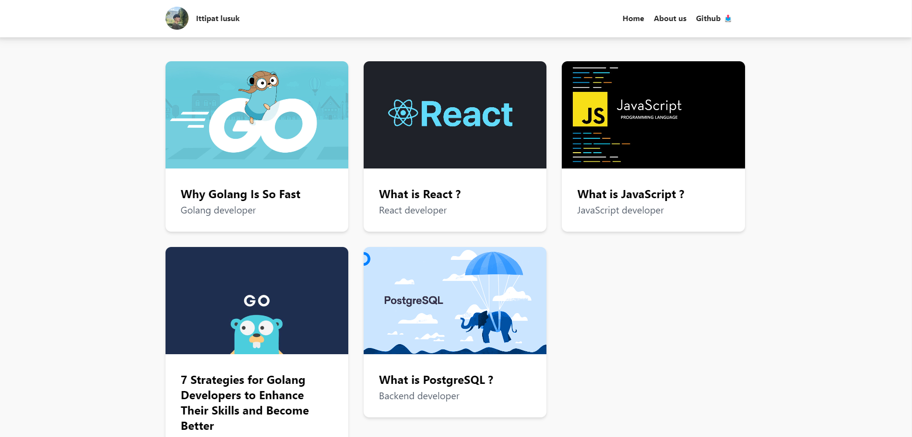

# Myblogs-Microservice

## 🗎 Microservice example concept
Develop a microservices system with ReactJS and Golang, Database PostgreSQL Redis, Message queue Kafka, Platform Docker, Kubernetes
## 💻 Fontend Stack
#### Stack : 
-  ReactJs (vite)
- TailwindCSS

## 📦 Backend Stack
#### Stack : 
-  Golang (gofiber, clean architecture)
- PostgreSQL
- Redis (caching)
- Kafka (message queue)

## userService

This service, You can manage requests with any functions for user. The last in this service can produce about data with topics for blogService.

## blogService

This service, You can manage requests with any functions for blogs. The last in this service can consume about data with topics from userService.

## Demo

